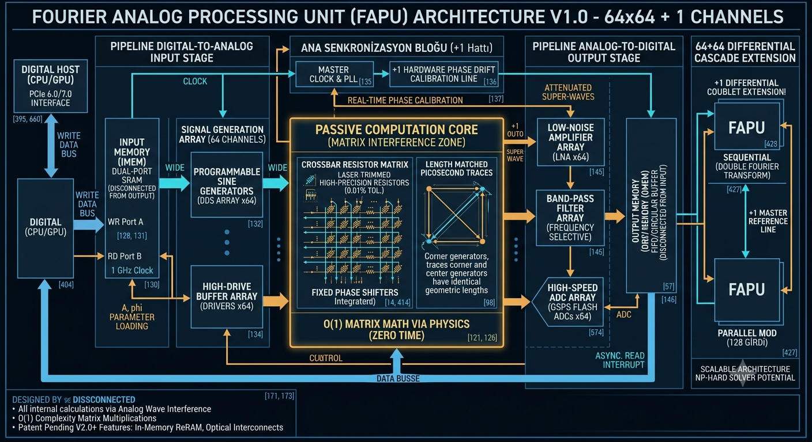

### FAPU MİMARİSİ: İÇ YAPISI VE VERİ AKIŞ BLOK DİYAGRAMI

Bu diyagram, sistemin donanımsal katmanlarını ve sinyalin "dijitalden analog RF'e, oradan tekrar dijitale" yolculuğunu 5 ana aşamada göstermektedir.

#### 1. DİJİTAL ARAYÜZ VE BELLEK KATMANI (Pipeline Giriş)

Sistemin dijital ana bilgisayarla (CPU/GPU) konuştuğu ve veri depoladığı ilk kısımdır.

* **Ana Bilgisayar (CPU/GPU Host):** Veriyi PCIe üzerinden gönderir/alır [588].
* **Giriş Bellek Bloğu (IMEM):** Dual-Port SRAM mimarisi [128]. Ana işlemciden gelen matris verilerini (genlik ve faz parametrelerini) kabul eder [62]. Bir kapıdan veri yazılırken, diğer kapıdan 1 GHz hızında DDS jeneratörlerini besler [130].
* **Çalışma Prensibi:** Dijital veriler IMEM'e yazılır ve işlem emriyle birlikte paralel geniş veri yolu (Wide Bus) üzerinden jeneratör katmanına pompalanır [61, 62].

#### 2. SİNYAL ÜRETİM VE YÜKLEME KATMANI (Veri Giriş - DDS/Driver)

Dijital parametrelerin fiziksel sinüs dalgalarına dönüştüğü aşamadır.

* **Programlanabilir Sinüs Jeneratörleri (64 Adet DDS/RF DAC):** IMEM'den gelen dijital genlik ve faz parametrelerini alır [123, 133]. 1 GHz RF bandında saf sinüs dalgaları üretir [132].
* **Yüksek Hızlı Sürücüler (64 Adet High-Drive Buffers):** DDS çıkışındaki sinüs dalgasını güçlendirir [134]. Dalganın, pasif çekirdekte sönümlenmeyecek yüksek bir akım kapasitesiyle enjekte edilmesini sağlar [134].
* **Çalışma Prensibi:** Sayısal veriler, her kanal için saf sinüs dalgasının genlik ($A$) ve faz ($\phi$) parametresine atanır [123].

#### 3. ANA SENKRONİZASYON BLOĞU (+1 Referans Hattı)

Tüm sistemin uyum içinde çalışmasını sağlayan "orkestra şefi" [8].

* **Master Saat ve PLL Bloğu:** Ultra kararlı faza kilitli döngü [PLL] ve referans hattı [135].
* **+1 Kalibrasyon Kanalı:** Tüm jeneratörlerin ve kaskat modüllerin tek bir senkronizasyonda kalmasını sağlayan donanımsal referans hattı [136, 137]. Termal faz kaymalarını (phase drift) gerçek zamanlı olarak donanımsal kalibre eder [137].

#### 4. PASİF HESAPLAMA ÇEKİRDEĞİ (Matris Girişim Çekirdeği)

İşlemcinin kalbidir; işlemlerin (matris çarpımları, girişimler) fiziksel olarak gerçekleştiği pasif bölge [11].

* **Diferansiyel ve Simetrik Matris Mimarisi:** RF entegre devresi gibi tasarlanmış [106], çapraz hatlar [Crossbar Matrix] [138]. Gürültüyü yok edecek diferansiyel (çift hatlı) yapı [107].
* **Pikosaniye Hassasiyetinde Yol Uzunluğu Eşitleme (Length Matching):** Çip üzerindeki tüm yollar tıpatıp aynı uzunlukta ve empedanstadır [105, 142]. Mesafe kaynaklı faz kaymalarını sıfırlar [143].
* **Süper Hassasiyetli Direnç Ağları:** Lazerle ayarlanmış (Laser-Trimmed), %0.01 ila %0.005 tolerans sınırında ince film dirençler [86, 138, 141].
* **Sabit Faz Kaydırıcılar:** Tek kübitlik kapı işlemlerini simüle etmek için analog faz manipülasyonu [14, 412].
* **Analog Toplayıcı Ağları:** Op-Amp barındırmayan, pasif dirençliinterference düğüm noktaları [15, 139].
* **Çalışma Prensibi (Sıfır Zamanlı Hesaplama):** Sürücülerden gelen 64 sinüs dalgası, pikosaniye hassasiyetinde eşitlenmiş yollar üzerinden direnç matrisine pompalanır [124]. Dalgalar çarpışırken fiziksel olarak yapıcı ve yıkıcı girişime (interference) uğrar [125]. Matematiksel işlemler (toplama, çarpma, Fourier), doğanın fizik kuralları sayesinde "sıfır işlem döngüsüyle" anlık olarak gerçekleşir [126].

#### 5. ÇIKISH YAKALAMA VE ANALİZ KATMANI (Data Output)

Hesaplanan analog "Süper Dalga"nın dijitale geri dönüştüğü son aşamadır.

* **Ultra Düşük Gürültülü RF Yükselticiler (64 Adet LNA):** Çekirdekten sönümlenerek çıkan karmaşık süper dalgayı, gürültü eklemeden dijital dünyaya aktarılacak seviyeye yükseltir [91, 144, 145].
* **Keskin Bant Geçiren Filtreler (Band-pass Filters):** Dalgayı bileşenlerine ayırır, birbirine yakın frekansları gürültü tabanına takılmadan ayırır [21, 127, 146].
* **Yüksek Hızlı ADC'ler (64 Adet Flash ADC):** Gecikmesiz okuma sağlamak için Nyquist teoremine uygun olarak (GSPS hızında) örnekleme yapar [574, 576]. Analog sonucu dijital 0-1 dünyasına çevirir [22].
* **Çıkış Bellek Bloğu (OMEM):** Asenkron çalışan yüksek hızlı FIFO veya dairesel tampon bellek [FIFO / Circular Buffer] [34, 146]. Sonuç verilerini depolar ve dolduğunda ana işlemciye "Hesaplama Bitti (Interrupt)" sinyali gönderir [67, 147].
* **Çalışma Prensibi:** Çekirdekteki girişimler bitip filtrelere ulaştığı an, ADC'ler sonuçları OMEM'e yazar ve CPU veriyi buradan parça parça çekebilir [35, 66].

---

### BÜYÜK RESİM: 64+64 DİFERANSİYEL KASKAT MİMARİSİ

Eğer sistemi **64+64** (yani **128 kanallı**) yapacak şekilde genişletirsek, diyagram şu şekli alıyor [543]:

Aynı temel yapıdan **iki adet 64'lük blok** yan yana veya ardışık (kaskat) olarak konumlandırılıyor [560]:

1. **Paralel Mod:** İki bloğun IMEM girişleri farklı veri vektörlerini kabul eder ve aynı anda 128 farklı kaynaktan gelen geniş bir veri setini işler [560].
2. **Kaskat Mod:** İlk 64'lük bloğun çıkışındaki analog sinyal, ikinci 64'lük bloğun girişine beslenerek "İki Kademeli Fourier Dönüşümü" (Double Fourier Transform) veya derin yapay sinir ağı katmanları simüle edilir [469, 561].
3. **Synchronization:** İki blok arasındaki etkileşim, diferansiyel hatlar üzerinden sınırlandırılmış bağlantılarla yapılır [548] ve her iki blok da aynı "+1 Master Referans Hattı" ile senkronize edilir [537, 538].

